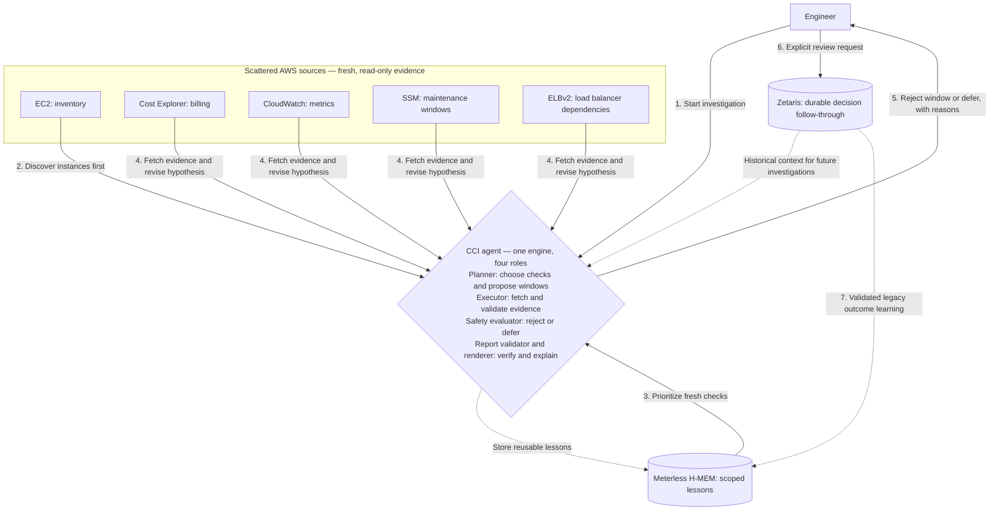
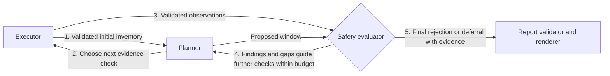
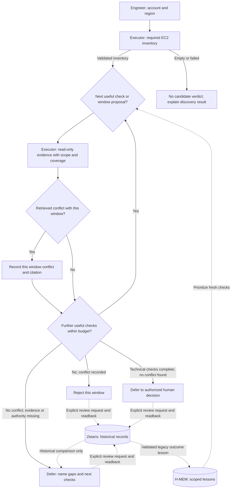

```mermaid
flowchart TD
    U[Engineer] -->|1. Start investigation| A{"CCI agent — one engine, four roles<br/>Planner: choose checks and propose windows<br/>Executor: fetch and validate evidence<br/>Safety evaluator: reject or defer<br/>Report validator and renderer: verify and explain"}
    subgraph Sources[Scattered AWS sources — fresh, read-only evidence]
        EC2[EC2: inventory]
        CE[Cost Explorer: billing]
        CW[CloudWatch: metrics]
        SSM[SSM: maintenance windows]
        ELB[ELBv2: load balancer dependencies]
    end
    EC2 -->|2. Discover instances first| A
    M[(Meterless H-MEM: scoped lessons)] -->|3. Prioritize fresh checks| A
    CE & CW & SSM & ELB -->|4. Fetch evidence and revise hypothesis| A
    A -->|5. Reject window or defer, with reasons| U
    U -->|6. Explicit review request| Z[(Zetaris: durable decision follow-through)]
    Z -. Historical context for future investigations .-> A
    A -. Store reusable lessons .-> M
    Z -.->|"7. Validated legacy outcome learning"| M
```

```mermaid
flowchart LR
    X["Executor"] -->|"1. Validated initial inventory"| P["Planner"]
    P -->|"2. Choose next evidence check"| X
    X -->|"3. Validated observations"| E{"Safety evaluator"}
    P -->|"Proposed window"| E
    E -->|"4. Findings and gaps guide further checks within budget"| P
    E -->|"5. Final rejection or deferral with evidence"| R["Report validator and renderer"]
```

Detailed investigation and decision flow

```mermaid
flowchart TD
    U[Engineer: account and region] --> D[Executor: required EC2 inventory]
    D -->|Validated inventory| P{Next useful check or window proposal?}
    D -->|Empty or failed| N["No candidate verdict; explain discovery result"]
    P --> X[Executor: read-only evidence with scope and coverage]
    X --> E{Retrieved conflict with this window?}
    E -->|Yes| R[Record this window conflict and citation]
    R --> G{Further useful checks within budget?}
    E -->|No| G
    G -->|Yes| P
    G -->|"No; conflict recorded"| V[Reject this window]
    G -->|"No conflict; evidence or authority missing"| F[Defer: name gaps and next checks]
    G -->|"Technical checks complete; no conflict found"| H[Defer to authorized human decision]
    M[(H-MEM: scoped lessons)] -. Prioritize fresh checks .-> P
    Z[(Zetaris: historical records)] -. Historical comparison only .-> F
    V -. Explicit review request and readback .-> Z
    F -. Explicit review request and readback .-> Z
    H -. Explicit review request and readback .-> Z
    Z -. Validated legacy outcome lesson .-> M
```

